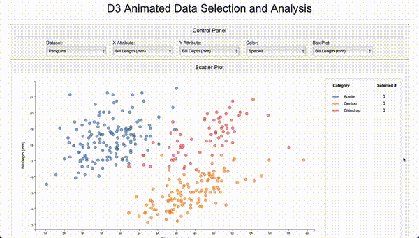

# D3 Animated Data Selection and Analysis

An interactive data visualization tool using D3.js to explore dataset attributes through linked scatter plots and box plots. This project enables users to select, filter, and analyze data points dynamically, with smooth transitions and animated box plots that respond to lasso selections on the scatter plot. 

Here's a short demo of the project in action:



## Project Overview

This visualization tool includes two main linked visualizations: a scatter plot for exploring quantitative data relationships and a box plot for showing summary statistics of selected points. Users can select different datasets, choose specific attributes to analyze, and interactively select points using a lasso tool. The box plot updates dynamically to reflect summary statistics of the selected points, with animated transitions for enhanced UX.

### Key Features

- **Interactive Scatter Plot**: Select and display different attributes on the x and y axes, with data points colored by categorical attributes.
- **Lasso Selection**: Use a lasso tool to select data points on the scatter plot, dynamically updating the box plot.
- **Animated Box Plot**: Displays summary statistics (min, max, quartiles, etc.) for selected points with smooth D3 transitions.
- **Control Panel**: Allows users to select datasets, adjust attributes, and choose colors.
- **Responsive Transitions**: Data points and box plot elements smoothly animate when attributes or datasets change.

## Visualization Details

### Scatter Plot
- **Dynamic Attribute Selection**: Choose attributes for the x-axis, y-axis, color, and box plot visualization.
- **Color Legend**: Displays the color mappings for the categorical variable selected in the control panel.
- **Lasso Tool**: Interactively select data points, with visual feedback for selected and unselected points.
- **Transition Effects**: Data points animate to new positions when attributes or datasets change, providing a smooth and intuitive experience.

### Animated Box Plot
- **Lasso-Linked Summary Statistics**: Displays box-and-whisker plots summarizing selected points, grouped by the color attribute.
- **Smooth Transitions**: Box plot elements animate when updated, with staged transitions for whiskers, boxes, medians, and outliers.
- **Adaptable Layout**: Handles cases of empty groups and dynamically resizes based on the selected data subset.
- **Axis Update**: Automatically scales based on the data range of the selected dataset and attribute.

## How It Works

1. **Select a Dataset**: Use the control panel to select a dataset from the dropdown options.
2. **Choose Attributes**: Adjust x-axis, y-axis, color, and box plot attributes to customize the scatter plot and box plot views.
3. **Interact with Scatter Plot**: Use the lasso tool to select data points. This will update the box plot to display summary statistics for the selected points.
4. **Hover and View Details**: Tooltips display data point details, and labels in the scatter plot show the count of selected points.

## Technical Implementation

- **D3.js**: Used for building the scatter plot, box plot, and all transitions.
- **Data Parsing**: JavaScript processes the dataset, dynamically updating based on user selections.
- **Scatter Plot**: Displays quantitative relationships with customizable attributes, color-coding by categorical attributes.
- **Box Plot with Animated Transitions**: Draws summary statistics for selected points, grouped by the color attribute. Uses staged transitions for updating elements:
  - **Whiskers**: Transition to new positions when updated.
  - **Box and Median**: Smoothly animate from old to new positions.
  - **Outliers**: Fade in and out as they appear or disappear.
- **Lasso Tool**: Interactive selection with visual feedback. Clears selection on click outside of points.

## Features and Transition Details

- **Scatter Plot Transitions**: Points and axes animate to new positions when attributes or datasets are changed.
- **Box Plot Transitions**: Includes staged animations for whiskers, boxes, and outliers to ensure smooth updates:
  - **Grow/Shrink Transitions**: Box plots smoothly shrink to zero for empty selections and grow back for new selections.
  - **Staggered Transitions**: Multiple box plots animate in sequence, providing a pleasing visual effect.
- **Responsive Layout**: Automatically resizes and adapts to selected data subsets.

## Hosting the Project Locally

To host this project on your local machine, follow these steps:

### Prerequisites
- Visual Studio Code (VSCode)
- Git installed on your system

### Steps

1. **Clone the Repository**:
   - Open your terminal and run the following command:
   ```
   bash
   git clone https://github.com/SharanB7/D3-Animated-Data-Selection-and-Analysis.git 
   ```

2. **Open the Project in VSCode**:
   - Navigate to the project directory and open it in VSCode:
   ```
   cd D3-Animated-Data-Selection-and-Analysis
   code .
   ```

3. **Install the "Live Server" Extension**:
   - Open Visual Studio Code.
   - Go to the Extensions tab or press `Ctrl+Shift+X` (Windows/Linux) / `Cmd+Shift+X` (Mac).
   - Search for "Live Server" and install it.

4. **Run the Project**:
   - Locate and open `index.html` in your project folder.
   - Right-click on the file and select "Open with Live Server".
   - Alternatively, click on the "Go Live" button at the bottom right corner of VSCode.

The project should now be hosted locally and accessible at `http://127.0.0.1:5500` (or another port specified by Live Server).